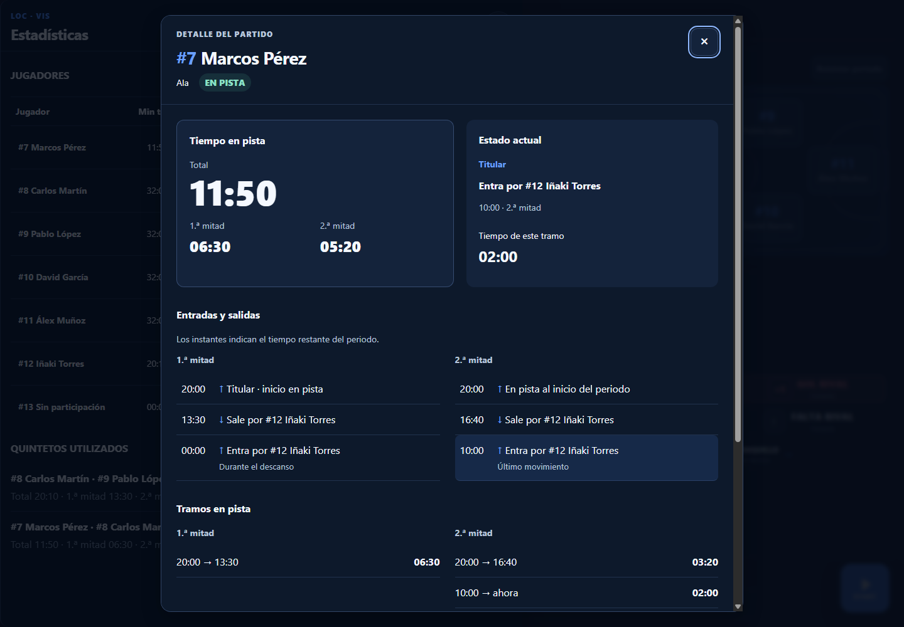
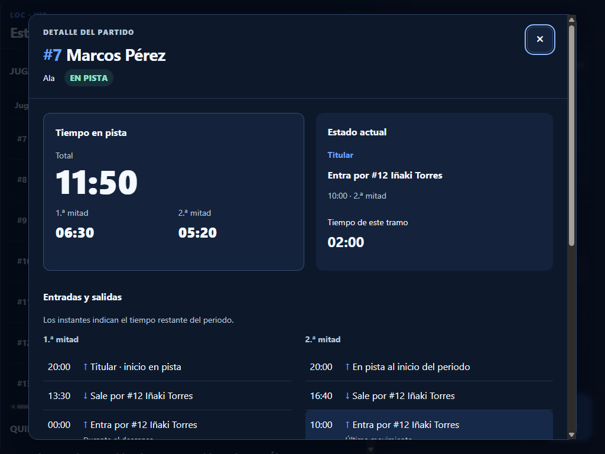
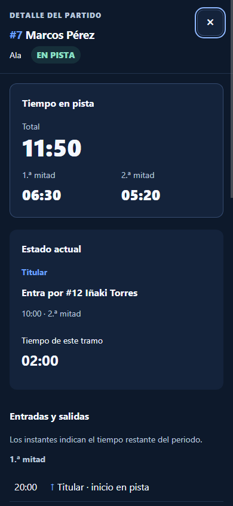

# Futsal Stats

## Integridad de partidos finalizados

Finalizar guarda el partido y sus eventos en este dispositivo. La sincronización cloud puede quedar pendiente si no hay conexión. El histórico muestra el estado técnico por separado: **verificado** significa que se compararon los IDs reales en Supabase con el manifiesto de cierre; **pendiente** indica trabajo local; **inconsistencia** indica diferencias comprobadas; **no verificable** indica que cloud no respondió; **sin verificar** indica que falta un manifiesto confiable (por ejemplo, un partido anterior a esta función).

En el detalle del partido, **Comprobar integridad** vuelve a consultar cloud y **Reparar sincronización** reencola solo eventos ausentes usando los IDs y tiempos originales. El outbox sobrevive a recargas; el arranque, la recuperación de conexión y la vuelta a la app vuelven a intentarlo. No borres los datos del dispositivo capturador si otro dispositivo muestra un partido incompleto. Consulta [arquitectura y recuperación](docs/architecture/match-integrity-recovery.md).

Antes de publicar el frontend, aplica `database/migrations/0012_match_integrity_manifest.sql` en Supabase. Sin esa tabla y su RPC, la verificación cloud aparecerá como no disponible y las operaciones de manifiesto permanecerán en cola.

**Estado actual: desarrollo post-alpha · baseline estable: `alpha_0.1`**

Futsal Stats es una aplicación web progresiva para registrar, seguir y consultar estadísticas de partidos de fútbol sala en tiempo real. Está orientada a entrenadores, analistas y miembros del cuerpo técnico que necesitan operar con rapidez desde móvil, tablet u ordenador durante un partido.

La aplicación funciona por defecto de forma **local-first** sobre IndexedDB. El modo cloud puede
activarse por despliegue con Supabase, autenticación passwordless por email, RLS y repositorios offline-first. Las
acciones de partido se confirman localmente y se sincronizan mediante una cola durable cuando hay
conectividad. Consulta [`cloud-foundation.md`](docs/architecture/cloud-foundation.md) y
[`offline-sync.md`](docs/offline-sync.md).

> **Estado Alpha**  
> `alpha_0.1` permanece como referencia histórica. El árbol de desarrollo incorpora posteriormente
> workspaces de equipo, acceso por membresía, histórico, perfiles individuales y sincronización
> offline resiliente.

---

## Vista general

Futsal Stats concentra en una única interfaz las operaciones principales de un partido:

- preparación de equipos y convocatoria, con elección posterior del quinteto inicial;
- cronómetro y control del periodo;
- marcador, faltas y sanciones; disparos a puerta o fuera, paradas y faltas recibidas;
- sustituciones y quinteto actual;
- registro de eventos en directo;
- estadísticas derivadas por jugador y quinteto;
- exportación CSV;
- histórico navegable con filtros por temporada y competición;
- perfiles de jugador con métricas de temporada y carrera;
- diseñador y biblioteca de estrategias;
- persistencia offline mediante IndexedDB y cola de sincronización durable.
- Home operativa por equipo con KPIs de temporada, balance y goles, ranking de minutos de los
  últimos seis partidos, último resultado, histórico reciente y estado rápido de la plantilla.

La experiencia visual está diseñada alrededor de un **tema oscuro azulado**, alto contraste y controles grandes pensados para uso táctil durante el partido.

---

## Capturas de pantalla

### Gestor de partidos

Desde esta pantalla se puede continuar un partido activo, consultar partidos finalizados o iniciar uno nuevo.


### Partido en directo

Vista principal para operar durante el encuentro: estadísticas, marcador, cronómetro, quinteto en pista, últimos eventos y acciones rápidas.


### Estadísticas detalladas

Panel de estadísticas por jugador con minutos, goles, goles a favor/en contra, plus/minus, faltas, tarjetas y expulsiones, además de exportación CSV. Los partidos creados con el esquema estadístico v2 también muestran disparos, tiros a puerta y fuera, paradas y faltas recibidas. Los partidos anteriores muestran estas métricas como no registradas.


### Registro de faltas y sanciones

Flujo contextual para seleccionar al jugador que comete la falta y, cuando corresponde, registrar la sanción disciplinaria asociada.


### Detalle del tiempo en pista

El detalle de jugador reconstruye entradas, salidas y tramos efectivos en pista, incluyendo el
tiempo del tramo actual y el reparto por periodos.



| Tablet                                                                              | Móvil                                                                              |
| ----------------------------------------------------------------------------------- | ---------------------------------------------------------------------------------- |
|  |  |

---

# Funcionalidades disponibles

## Equipos y jugadores

- Creación y edición de equipos.
- Equipo **Apaga** preconfigurado con 16 jugadores, disponible automáticamente en cada instalación.
- Gestión de dorsales, nombres, posiciones y estado de los jugadores.
- Vista de Plantilla con resumen global, jugadores activos e inactivos y selector de temporada.
- Estadísticas por jugador en la Plantilla: partidos, titularidades, minutos, goles, balance `+/−` y
  media de minutos.
- Búsqueda por nombre o dorsal, filtros por estado y posición, y ordenación por las métricas
  principales.
- Selección de convocatoria y elección del quinteto inicial desde la pista antes de iniciar.
- Perfil deportivo editable con dorsal, nombre, posición, estado, pierna dominante y notas.
- Fotografías seleccionadas desde archivo JPEG, PNG o WebP, con previsualización, sustitución,
  eliminación y validación de contenido y tamaño.
- Histórico individual y métricas separadas por temporada.
- El perfil muestra Paradas y Faltas recibidas en tarjetas independientes; distingue cero de métricas no registradas en la temporada seleccionada.
- Roles `OWNER` y `EDITOR` con edición; rol `VIEWER` con acceso de solo lectura en Plantilla y Perfil.

## Gestión de partidos

- Un único partido activo simultáneamente.
- Resumen de inicio calculado desde partidos, eventos y plantilla del equipo activo, con accesos al
  detalle del último partido, al histórico completo y a la plantilla.
- Continuación de un partido en curso después de cerrar o recargar la aplicación.
- Histórico de partidos finalizados con fecha y resultado.
- Tarjetas de historial adaptables a tablet y escritorio: el contenido y las acciones conservan zonas separadas incluso con nombres largos.
- En escritorio la barra lateral permanece visible mientras se desplaza el contenido de la vista; en móvil se conserva la navegación inferior.
- Filtros por temporada, competición y estado.
- Detalle de partido en modo consulta con cronología y estadísticas reproducibles desde eventos.
- Eliminación transaccional de partidos y sus eventos asociados.
- Flujo para abandonar un partido y comenzar otro sin conservar estado residual.

## Partido en directo

- Reloj de dos periodos con inicio, parada, reanudación y cambio de periodo.
- Cabecera compacta con tiempo, periodo y quinteto actual.
- Control flotante del reloj optimizado para uso táctil.
- Sustituciones rápidas pulsando sobre el jugador que sale y seleccionando al jugador que entra.
- Registro de goles a favor y en contra.
- En partidos con estadísticas v2, un gol con goleador suma automáticamente un tiro a puerta y un disparo total a ese jugador; no requiere registrar otro disparo.
- Selección opcional del goleador entre los jugadores en pista, con goles individuales derivados del historial.
- Registro de faltas propias y del rival por periodo.
- Registro diferenciado de faltas acumulativas e infracciones disciplinarias que no incrementan el
  contador de faltas del periodo.
- Tarjetas, expulsiones e inferioridades de dos minutos de tiempo efectivo con reposición manual.
- Identificación rápida por dorsal de jugadores rivales sancionados, reutilizable durante el partido.
- Panel de disciplina con edición del jugador asociado a una amarilla propia y del dorsal de una
  amarilla rival, sin alterar el instante ni la falta original.
- Marcador y cronología de eventos actualizados inmediatamente.
- Deshacer goles, faltas y sustituciones sin eliminar el historial original.
- Acciones rápidas para los eventos más habituales del partido.

## Estadísticas derivadas

- Minutos jugados y porcentaje de participación.
- Detalle por jugador de entradas, salidas, tramos en pista y duración del tramo actual.
- Goles a favor y en contra con cada jugador en pista.
- Plus/minus por jugador.
- Tiempo, goles y plus/minus por quinteto.
- Snapshot del quinteto presente en cada gol.
- Exportación CSV de estadísticas legibles, sin identificadores internos, en cualquier estado del partido.
- Métricas de temporada y carrera calculadas desde partidos y eventos, sin agregados duplicados.

## Funcionalidad de reglamento

La funcionalidad de consulta/asistencia relacionada con el reglamento permanece fuera de la
navegación principal y no forma parte del flujo crítico de partido.

Su reintroducción queda pospuesta hasta que la experiencia, el contenido y su compatibilidad en dispositivos móviles estén suficientemente validados.

---

# Manual de uso

## 1. Preparar los equipos

Accede a **Equipos** desde la navegación principal.

Desde aquí puedes:

1. crear un equipo nuevo;
2. editar un equipo existente;
3. gestionar su plantilla;
4. definir dorsal, nombre, posición y estado de cada jugador.

Los equipos y jugadores se guardan automáticamente en el dispositivo mediante IndexedDB.

### Consultar el perfil de un jugador

Desde **Plantilla**, pulsa **Ver perfil** en un jugador. El perfil permite guardar foto, pierna
dominante y notas deportivas, consultar sus partidos terminados y cambiar entre la vista de carrera
y cada temporada. Las métricas se recalculan desde los eventos de partido y no se almacenan como
totales duplicados.

La propia Plantilla muestra un resumen recalculado por temporada. Puedes buscar por nombre o dorsal,
filtrar jugadores activos/inactivos y posiciones, y ordenar por dorsal, nombre, minutos, partidos o
goles. El balance `+/−` indica la diferencia entre goles a favor y en contra mientras el jugador
estaba en pista.

Las fotografías se eligen desde un archivo local; no se introducen URLs manualmente. Se admiten
JPEG, PNG y WebP de hasta 5 MB, con previsualización antes de guardar. En modo cloud, las acciones de
edición solo aparecen para miembros `OWNER` o `EDITOR`.

---

## 2. Crear un partido

Desde **Partidos**, pulsa **Nuevo partido**.

El flujo de preparación permite seleccionar:

1. el equipo propio;
2. el rival y la información disponible del encuentro;
3. la convocatoria;
4. la convocatoria del equipo activo.

El quinteto inicial se selecciona después, desde la pista, y el partido no puede iniciarse hasta
confirmar exactamente cinco jugadores.

Una vez creado, el partido pasa a ser el único partido activo de la aplicación.

> Mientras exista un partido activo, el acceso directo a `/matches/new` está protegido para evitar crear accidentalmente un segundo partido simultáneo.

---

## 3. Continuar un partido guardado

Si cierras, recargas o vuelves más tarde a la aplicación, entra en **Partidos**.

El bloque **Partido en curso** muestra:

- equipos;
- resultado;
- periodo;
- tiempo actual del reloj.

Pulsa **Continuar partido** para volver a la vista en directo.

---

## 4. Manejar el cronómetro

En la pantalla del partido en directo encontrarás el reloj principal y su control flotante.

El flujo habitual es:

1. iniciar el reloj al comenzar el periodo;
2. detenerlo cuando el juego se interrumpe;
3. reanudarlo al volver el balón a juego;
4. realizar el cambio de periodo cuando corresponda.

El reloj utiliza un snapshot persistido y calcula el tiempo visible a partir del tiempo real para minimizar desviaciones provocadas por intervalos retrasados del navegador.

Si se recupera un partido cuyo periodo llegó a cero mientras la aplicación no estaba activa, el estado se sincroniza y se persiste la parada correspondiente.

---

## 5. Registrar un gol propio

En **Acciones rápidas**, pulsa **Gol**.

Cuando el flujo lo solicita, puedes seleccionar al goleador entre los jugadores que se encuentran en pista.

Al registrar el evento se actualizan automáticamente:

- marcador;
- goles individuales;
- goles a favor del quinteto;
- plus/minus de los jugadores presentes;
- cronología del partido.

---

## 6. Registrar un gol rival

Pulsa **Gol rival** en las acciones rápidas.

El evento actualiza el marcador y las estadísticas derivadas de los jugadores que estaban en pista en ese momento, incluyendo goles en contra y plus/minus.

---

## 7. Registrar una falta propia

Pulsa **Falta**.

Después:

1. selecciona al jugador que cometió la falta;
2. elige la sanción correspondiente cuando exista:
   - sin tarjeta;
   - amarilla;
   - segunda amarilla + expulsión;
   - roja directa.

El evento queda incorporado al historial y actualiza las estadísticas derivadas.

Cuando la acción disciplinaria no deba contar como falta acumulativa, el flujo permite registrarla
como infracción que **no suma falta**. La cronología y el panel de disciplina indican explícitamente
si el evento incrementa o no el contador.

---

## 8. Registrar una falta rival

Pulsa **Falta rival**.

Las faltas del rival se contabilizan por periodo y se reflejan en el estado del partido.
La acción rápida **Falta a favor** permite elegir al jugador que recibió la falta entre quienes están en pista, o **Ninguno / No aplica**. Esta acción conserva el estado del cronómetro.

Para registrar un **Disparo a favor**, elige al jugador en pista y después **Tiro a puerta** o **Tiro fuera**. El modal mantiene la selección del quinteto, los dos resultados y **Cancelar** en bloques separados; cancelar no registra eventos. Para una **Parada**, elige al jugador en pista y confirma. Ambas acciones conservan el estado del cronómetro y se pueden deshacer. Si el disparo termina en gol, registra el gol con goleador: ese evento ya aporta el tiro a puerta.

Cuando sea necesario identificar a un rival sancionado, la aplicación permite reutilizar su dorsal durante el encuentro.

Desde el panel **Disciplina** se puede corregir posteriormente el dorsal asociado a una amarilla
rival. Las amarillas propias permiten reasignar el jugador. La corrección mantiene el evento en su
instante original y no mueve ni duplica la falta relacionada.

---

## 9. Registrar disciplina del banquillo

La acción **Disciplina banquillo** permite acceder al flujo específico destinado a jugadores o miembros del cuerpo técnico que no forman parte del quinteto en pista.

Utiliza esta opción para mantener separados los eventos del terreno de juego y los asociados al banquillo/cuerpo técnico.

---

## 10. Realizar una sustitución

Para realizar una sustitución rápida:

1. pulsa sobre el jugador que va a salir dentro del quinteto actual;
2. selecciona al jugador que entra;
3. confirma la sustitución cuando el flujo lo requiera.

La aplicación conserva el evento y actualiza el quinteto actual y el cálculo de minutos de juego.

---

## 11. Consultar el quinteto en pista

La parte superior derecha de la vista en directo representa el quinteto actual sobre una pista de fútbol sala.

Cada jugador aparece identificado mediante dorsal y nombre, facilitando comprobar rápidamente quién está participando antes de registrar un evento.

---

## 12. Consultar los últimos eventos

El panel **Últimos eventos** muestra las acciones recientes del partido junto con el tiempo de juego asociado.

Pulsa **Ver todos** para acceder a una visión más completa del historial cuando esté disponible en el flujo correspondiente.

Los eventos relevantes se almacenan como `MatchEvent` y se ordenan mediante `sequence` y `timestamp`.

---

## 13. Deshacer una acción

La aplicación permite deshacer eventos compatibles, como goles, faltas y sustituciones.

Internamente no se elimina el evento original. Se añade un evento compensatorio `EVENT_UNDONE`, manteniendo un historial reproducible y permitiendo reconstruir las estadísticas de forma determinista.

---

## 14. Consultar estadísticas

Desde el panel **Estadísticas**, pulsa **Ver todas**.

La vista detallada permite consultar por jugador:

- minutos;
- goles;
- goles a favor;
- goles en contra;
- plus/minus;
- faltas;
- tarjetas amarillas;
- segundas amarillas;
- rojas;
- expulsiones.

También se muestran los quintetos utilizados durante el partido y sus estadísticas derivadas.

Al pulsar sobre un jugador se abre su detalle de participación: tiempo total y por periodo, estado
actual, última sustitución, duración del tramo activo y cronología completa de entradas y salidas.

---

## 15. Exportar estadísticas a CSV

Desde la vista completa de estadísticas pulsa **Exportar CSV**.

El archivo generado contiene datos legibles para análisis posterior y evita incluir identificadores internos innecesarios.

La exportación puede realizarse tanto durante el partido como después de finalizarlo.

---

## 16. Finalizar o abandonar un partido

Desde las opciones del partido puedes completar su ciclo de vida.

Los partidos finalizados pasan al histórico y pueden consultarse posteriormente desde **Partidos**.

Si se elimina un partido, la aplicación elimina el partido y sus eventos dentro de una única transacción IndexedDB. Los equipos y jugadores no se eliminan y pueden reutilizarse inmediatamente.

---

# PWA y funcionamiento offline

Futsal Stats incluye manifiesto y Service Worker de Angular. En una compilación de producción, los recursos necesarios se precargan para poder utilizar la aplicación sin conexión después de la primera carga correcta.

IndexedDB es siempre el almacenamiento operativo del live match. En modo local, los datos
permanecen únicamente en el dispositivo. En modo cloud, cada escritura local genera una operación
durable con estado `pending`, `synced` o `failed`; la conexión remota nunca bloquea el registro de
una acción.

La cola sobrevive a recargas y cierres, reintenta fallos transitorios con backoff exponencial y se
reanuda al recuperar conectividad. Los UUID estables y las RPC idempotentes evitan duplicar eventos
si un envío se repite. Los errores irrecuperables aparecen en el partido y pueden reintentarse de
forma explícita.

> **Importante:** borrar los datos del sitio elimina la caché local, perfiles, partidos, eventos y
> operaciones todavía pendientes. No deben borrarse los datos del navegador para resolver un error
> de sincronización.

Para un entorno de partido se recomienda abrir la aplicación y comprobar que carga correctamente **antes de perder conectividad**.

---

# Estado de las iteraciones técnicas

| Iteración | Área                                      | Estado actual                           |
| --------- | ----------------------------------------- | --------------------------------------- |
| 1         | Dominio y contratos de persistencia       | Integrada                               |
| 2         | Modelo de datos sincronizable             | Integrada                               |
| 3         | Team Workspace                            | Integrada                               |
| 4         | Cloud Foundation                          | Integrada y activable por configuración |
| 5         | Incorporación y revocación de miembros    | Integrada                               |
| 6         | Histórico de partidos                     | Integrada                               |
| 7         | Perfiles de jugador                       | Integrada                               |
| 8         | Realtime para viewers y controlador único | Pendiente                               |
| 9         | Offline sync y recuperación               | Integrada                               |

La sincronización offline no habilita edición concurrente del live match. La política continúa
siendo un único dispositivo controlador; el realtime de observadores pertenece a la Iteración 8.

# Roadmap UX histórico

Las siguientes etapas documentan el plan histórico de consolidación de interfaz posterior a
`alpha_0.1`. Sus mejoras principales ya forman parte del estado actual.

## Iteración 1 — Consolidación UI/UX y design system

**Objetivo:** convertir la interfaz actual en un sistema visual completamente consistente y preparado para uso intensivo durante un partido.

Trabajo previsto:

- consolidar tokens globales de color, espaciado, tipografía, bordes, radios y elevación;
- mantener el tema oscuro basado en navy, midnight blue y azules fríos;
- eliminar colores y estilos hardcoded restantes;
- homogeneizar estados `hover`, `focus-visible`, `active`, `pressed`, `disabled` y `selected`;
- revisar contraste y accesibilidad;
- eliminar CSS/SCSS duplicado o legacy;
- reducir `!important`, nesting excesivo y especificidad innecesaria;
- unificar iconografía y dimensiones de controles.

### Criterio de finalización

No deberían existir dos componentes conceptualmente equivalentes con estilos, alturas o comportamientos visuales diferentes sin una razón de diseño explícita.

---

## Iteración 2 — Rediseño de controles de partido

**Objetivo:** dejar de tratar todas las acciones como botones genéricos y convertirlas en componentes especializados para operación rápida.

Trabajo previsto:

- diferenciar `Button`, `IconButton`, `ActionButton`, `ActionTile`, `SegmentedControl` y `PlayerTile`;
- rediseñar la geometría de las acciones rápidas;
- reforzar el feedback táctil de Gol, Gol rival, Falta, Falta rival y Disciplina banquillo;
- mantener targets táctiles cercanos o superiores a 44 px cuando corresponda;
- evitar interacciones dependientes exclusivamente de `hover`;
- optimizar los estados `pressed` para iPad y móvil;
- revisar la jerarquía entre acciones frecuentes, secundarias y administrativas;
- conservar colores semánticos de sanción sin saturar grandes superficies.

### Criterio de finalización

La diferencia respecto a la interfaz anterior debe ser estructural: geometría, composición, jerarquía e interacción; no únicamente un cambio de color o sombra.

---

## Iteración 3 — Optimización específica para tablet y móvil

**Objetivo:** considerar iPad y dispositivos móviles como plataformas de primer nivel, no como una versión reducida del escritorio.

Trabajo previsto:

- revisar layouts en portrait y landscape;
- comprobar puntos de ruptura por necesidad real del contenido;
- optimizar el grid de partido en pantallas intermedias;
- mejorar áreas táctiles y separación entre acciones críticas;
- revisar `safe-area-inset-*` en iOS cuando corresponda;
- eliminar dependencias de hover;
- revisar drawers, modales y overlays en Safari iOS/iPadOS;
- validar scroll, elementos `sticky` y controles `fixed`;
- comprobar tamaños próximos a 1024, 834, 768, 430, 390 y 375 px.

### Criterio de finalización

Las operaciones principales de un partido deben poder realizarse cómodamente en iPad y móvil sin zoom, sin targets demasiado pequeños y sin pérdida de funcionalidades críticas.

---

## Iteración 4 — Robustez de datos y ciclo de vida del partido

**Objetivo:** reforzar la seguridad del flujo local-first antes de ampliar funcionalidades.

Trabajo previsto:

- ampliar tests de recuperación ante cierre/recarga;
- probar interrupciones durante operaciones de escritura;
- reforzar mensajes de error y recuperación;
- validar comportamiento offline durante un partido completo;
- revisar migraciones de esquema Dexie antes de introducir cambios de datos;
- mantener operaciones críticas dentro de transacciones;
- validar que un fallo de eliminación nunca deje el estado de memoria desincronizado respecto a IndexedDB.

---

## Iteración 5 — Estadísticas y exportación

**Objetivo:** mejorar la explotación del histórico ya registrado sin comprometer la velocidad de entrada de datos.

Posibles líneas de trabajo:

- mejorar la lectura de estadísticas por jugador y quinteto;
- añadir comparativas y resúmenes visuales donde aporten valor;
- revisar la presentación de tiempo de juego y participación;
- mejorar la experiencia de exportación CSV;
- evaluar nuevos formatos de exportación únicamente si existe una necesidad clara;
- mantener el Event Store como fuente de verdad para todas las estadísticas derivadas.

---

## Iteración 6 — Revisión de la funcionalidad de reglamento

**Objetivo:** reevaluar la funcionalidad actualmente oculta antes de volver a exponerla al usuario.

Antes de reactivarla deberá validarse:

- compatibilidad real en Safari de iPhone y iPad;
- comportamiento sin backend si se mantiene ese requisito;
- tamaño de descarga y consumo de memoria;
- funcionamiento offline;
- tiempos de inicialización;
- experiencia de consulta durante un partido;
- calidad y trazabilidad del contenido reglamentario;
- comportamiento cuando la funcionalidad no pueda inicializarse.

La aplicación principal no debe depender de esta funcionalidad para registrar un partido.

---

# Tecnologías

- Angular 22 con componentes standalone.
- TypeScript estricto.
- Angular Signals para estado reactivo.
- Angular Router y Reactive Forms.
- Dexie sobre IndexedDB para persistencia.
- Supabase/PostgreSQL opcional, con código OTP por email y RLS por equipo.
- Outbox durable y sincronización offline-first con reintentos.
- Estrategias y fotos de jugador compartidas por Team en modo cloud, con caché local y permisos por membership.
- Angular Service Worker para capacidades PWA.
- SCSS responsive orientado a móvil y tablet.
- Vitest y Angular Testing Utilities.

---

# Requisitos

- Node.js compatible con Angular 22.
- npm.
- El proyecto declara `npm@12.0.2` como gestor recomendado.

---

# Instalación

```bash
npm install
```

---

# Ejecutar en local

```bash
npm start
```

La aplicación estará disponible normalmente en:

```text
http://localhost:4200
```

---

# Tests

```bash
npm test
```

Los tests cubren reloj, ciclo de vida, eventos, sustituciones, goles, faltas, estadísticas, perfiles,
histórico, undo, recuperación, repositorios, cola offline, reconexión, deduplicación, errores de
sincronización y flujos principales de UI.

---

# Build de producción

```bash
npm run build
```

El resultado se genera en:

```text
dist/futsal-stats
```

Para comprobar la instalación PWA y el comportamiento offline hay que servir el contenido compilado con un servidor HTTP local o mediante HTTPS. El Service Worker no se activa con la configuración de desarrollo de `ng serve`.

---

# Otros comandos

```bash
# Build continuo con configuración de desarrollo
npm run watch

# Ejecutar Angular CLI
npm run ng -- <comando>
```

---

# Rutas principales

| Ruta                  | Descripción                               |
| --------------------- | ----------------------------------------- |
| `/dashboard`          | Resumen del espacio de equipo activo      |
| `/players`            | Plantilla del equipo activo               |
| `/players/:playerId`  | Perfil, temporadas e histórico individual |
| `/matches`            | Gestor de partidos activos y finalizados  |
| `/matches/new`        | Datos y convocatoria del nuevo partido    |
| `/matches/:matchId`   | Detalle de un partido terminado           |
| `/settings`           | Ajustes y cambio del equipo activo        |
| `/login`              | Acceso passwordless por email             |
| `/settings/devices`   | Invitaciones, miembros y revocación       |
| `/join`               | Incorporación mediante invitación         |
| `/strategies`         | Diseñador y biblioteca táctica            |
| `/live/:matchId`      | Registro del partido en directo           |
| `/teams`              | Listado de equipos                        |
| `/teams/new`          | Creación de un equipo                     |
| `/teams/:teamId`      | Plantilla de un equipo                    |
| `/teams/:teamId/edit` | Edición de un equipo                      |

El acceso directo a `/matches/new` se protege cuando ya existe un partido activo.

---

# Arquitectura

El código se organiza por features y separa la lógica de dominio, aplicación y presentación:

```text
src/app/
├── core/
│   ├── clock/          # Motor de reloj puro
│   ├── cloud/          # Cliente, identidad y estado cloud
│   ├── persistence/    # Puertos, Dexie y repositorios Supabase
│   ├── sync/           # Outbox, red, reintentos y convergencia
│   └── utils/
├── features/
│   ├── device-enrollment/
│   ├── player-profiles/
│   ├── strategies/
│   ├── teams/
│   ├── match-setup/
│   ├── matches/
│   └── live-match/
│       ├── application/
│       ├── domain/
│       └── ui/
└── shared/
    ├── components/
    └── models/
```

## Persistencia

Las features no dependen directamente de Dexie ni del SDK de Supabase. Consumen repository ports
mediante tokens de inyección. `provideLocalPersistence()` conecta los contratos con adaptadores
Dexie para pruebas y modo local; en modo cloud, `providePersistence()` selecciona adaptadores
offline-first que escriben en IndexedDB y encolan la mutación remota.

La base de datos local contiene ocho tablas:

- `teams`
- `players`
- `playerProfiles`
- `playerPhotos`
- `matches`
- `events`
- `strategies`
- `syncQueue`

El seed integrado de Apaga es infraestructura local, transaccional e idempotente. Sus IDs
son UUIDs fijos para garantizar esa idempotencia; el resto de altas continúa usando
`createId()`/`crypto.randomUUID()`. Dexie v4 migró los IDs históricos y sus referencias; las
versiones posteriores añadieron histórico, perfiles y, en Dexie v7, la cola durable. Dexie v8
incorpora los assets binarios de fotografías separados de las entidades principales, sin guardar
imágenes base64 en los perfiles. Consulta [`cloud-data-model.md`](docs/architecture/cloud-data-model.md) y
[`offline-sync.md`](docs/offline-sync.md).

## Sincronización offline-first

En modo cloud, la escritura de partido, eventos y operación de outbox se realiza dentro de la misma
transacción IndexedDB. La interfaz recibe confirmación al terminar la transacción local, sin esperar
a la red. La cola compacta actualizaciones del mismo partido, conserva eventos únicos por UUID y se
procesa en orden de creación.

Los fallos transitorios se reintentan con backoff entre 1 segundo y 5 minutos. Después de cinco
intentos, o ante errores de permisos, validación o conflicto, la operación queda `failed` y se
presenta como accionable. Al arrancar o reconectar, se envían pendientes y después se actualiza la
caché desde la instantánea autorizada del equipo sin sobrescribir cambios locales sin resolver.

El reloj persistido forma parte del registro `Match`. Marcador, faltas, quintetos, minutos y estadísticas se calculan a partir de los eventos; no se guardan copias derivadas innecesarias.

## Event Store

Las acciones relevantes se registran como `MatchEvent`. Los eventos son append-only y se ordenan mediante `sequence` y `timestamp`.

La operación de deshacer añade un evento compensatorio `EVENT_UNDONE`, manteniendo intacto el evento original. Esto permite reconstruir de manera determinista:

- marcador;
- faltas por periodo;
- quinteto actual;
- minutos jugados;
- estadísticas de jugadores y quintetos;
- timeline visible.

## Reloj

El reloj guarda un snapshot con tiempo restante, duración del periodo, estado de ejecución y timestamp de inicio. Mientras está en marcha, el tiempo visible se proyecta desde el timestamp real para evitar drift por intervalos retrasados.

Al recuperar un partido, el estado se sincroniza con el tiempo transcurrido y se persiste una parada automática si el periodo ya llegó a cero.

## Eliminación de partidos

La eliminación de un partido y todos sus eventos se realiza dentro de una única transacción IndexedDB. Equipos y jugadores quedan fuera de esa transacción y pueden reutilizarse inmediatamente.

El estado en memoria del partido en directo solo se limpia después de que IndexedDB confirme la eliminación. Si la operación falla, el partido continúa disponible y se informa al usuario.

---

# Principios del proyecto

- Experiencia mobile-first y controles táctiles grandes.
- Un solo partido activo para evitar ambigüedades.
- IndexedDB como fuente persistente local.
- Eventos como fuente de verdad de las estadísticas.
- Cálculos de dominio puros y cubiertos por tests.
- Operaciones críticas transaccionales.
- Sin NgRx ni dependencias visuales innecesarias; la infraestructura cloud es opcional.
- La entrada de datos durante el partido tiene prioridad sobre cualquier funcionalidad secundaria.
- Las funcionalidades experimentales no deben comprometer la estabilidad del flujo principal.

---

# Baseline histórico `alpha_0.1`

Primera versión alpha de Futsal Stats centrada en establecer una base sólida para el registro y seguimiento de estadísticas durante partidos de fútbol sala.

Incluye el flujo principal de gestión de partido, persistencia local, registro de eventos, estadísticas derivadas, exportación CSV, soporte PWA y una interfaz optimizada para escritorio y dispositivos táctiles.

La funcionalidad relacionada con la consulta del reglamento permanece temporalmente oculta mientras continúa su validación.
